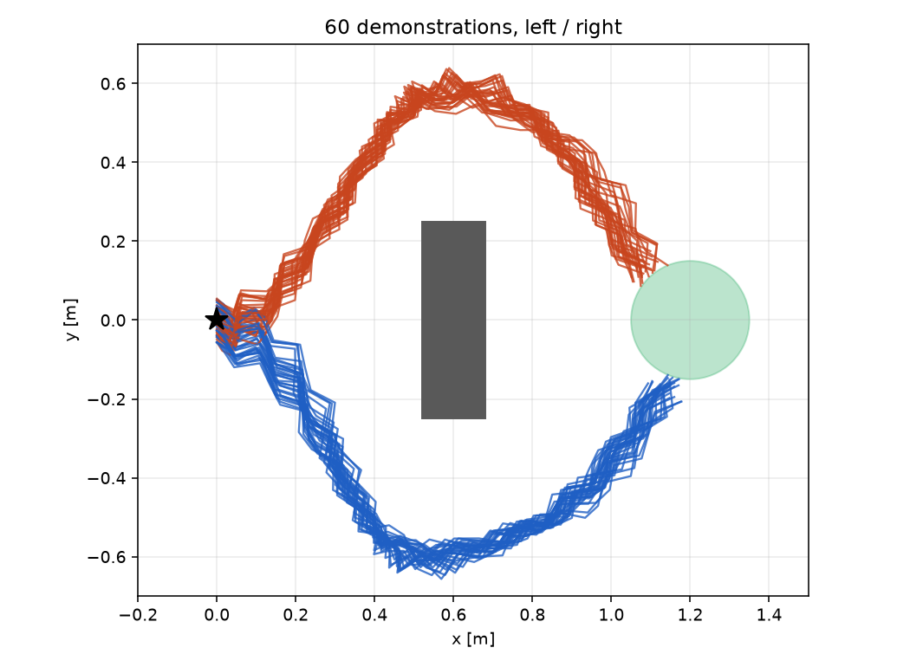

# MicroDuck Imitation Learning



Teach MicroDuck, a 15 cm tall bipedal duck robot, to walk around an obstacle by cloning an expert policy using regression, diffusion, and flow matching.

## Purpose

This task is intentionally compact, but the underlying idea is fundamental.

The duck starts in front of a wall and must reach a goal behind it. There are two valid routes around the obstacle. The expert demonstrations include both possibilities. If these commands are averaged, the resulting action points straight into the wall.

This is the central observation. A policy trained with squared error cannot represent a meaningful choice between "left" and "right". It learns the conditional mean, and that mean is a collision.

This homework provides a compact pipeline and asks you to implement the component that enables multimodal behavior:

- Implement the core mathematical formulation for diffusion and flow matching.
- Validate the idea on a 2-D toy problem before training on the robot.
- Interpret the results of controlled experiments on denoising steps and action horizon.

This homework builds on the locomotion policy from HW1. A frozen PPO actor (`assets/lowlevel.pt`) already knows how to walk. It runs at 50 Hz and follows velocity commands. The policy trained in this homework sits on top of it and emits commands at 5 Hz:

```
your policy  --(vx, wz) at 5 Hz-->  frozen PPO actor at 50 Hz  -->  joint targets
```

Code layout:

```
configs/
  config.yaml              # shared settings, training and evaluation
  toy.yaml                 # the 2-D warm-up
  task/navigation.yaml     # obstacle, goal, expert, action chunking
  policy/{mse,diffusion,flow}.yaml
  lowlevel/microduck.yaml  # the frozen HW1 locomotion policy
src/behavior_cloning/
  env/navigation.py        # episodes, observations, success
  data/expert.py           # the scripted expert that picks a side
  data/collect.py          # demonstration collection
  data/dataset.py          # observation history / action chunk windows, normalization
  data/toy.py              # the 2-D distributions
  policy/backbone.py       # the MLP shared by all three heads
  policy/head/             # mse.py, diffusion.py, flow.py   <-- your work is here
  policy/chunked.py        # normalization and action chunking around a head
  microduck/               # vendored from HW1, do not modify
scripts/
  train_toy.py             # 2-D warm-up
  collect.py               # record demonstrations
  train.py                 # train a policy
  eval.py                  # evaluate and plot
```

## Installation

### 1. Install uv

Install [uv](https://docs.astral.sh/uv/) using the instructions for your operating system.

### 2. Install the project environment

```bash
git clone https://github.com/xiaohu-art/MicroDuck-IL.git
cd MicroDuck-IL

uv sync                  # macOS (Apple Silicon, Metal GPU backend)
uv sync --extra cuda     # Linux / Windows with an NVIDIA GPU
uv sync --extra cpu      # Linux / Windows without a GPU
```

## Basic Commands

### The 2-D warm-up

```bash
uv run scripts/train_toy.py policy=diffusion toy.distribution=two_moons
```

This fits a 2-D distribution with one head and writes `toy_samples.png`. The left panel shows the training data, and the right panel shows samples generated by the model.

Two distributions are available:

| `toy.distribution` | What it is | What it tests |
|---|---|---|
| `two_moons` | two crescents, no conditioning | can the head represent more than one mode at all? |
| `rotating_modes` | two points on a circle at `±(π/4 + c·π/2)`, conditioned on `c ∈ [0, 1]` | does the conditioning path work, and can it still represent two modes? |

### Collecting demonstrations

```bash
uv run scripts/collect.py
```

This runs a scripted expert in 50 parallel environments. Each episode flips a coin to decide whether the expert passes the obstacle on the left or the right. The dataset contains an equal mix of both directions. It keeps only successful episodes and writes:

- `data/demos.npz` — 400 episodes
- `demonstrations.png` in the run directory — the figure at the top of this README

This typically takes about 20 s, including Genesis startup.

### Training

```bash
uv run scripts/train.py policy=diffusion
```

Any config value can be overridden on the command line with Hydra:

```bash
uv run scripts/train.py policy=flow seed=1
uv run scripts/train.py policy=diffusion train.num_epochs=600 device=cpu
```

The default run takes about 35 s for 300 epochs. Each run creates a directory under `outputs/`:

| File | Content |
|---|---|
| `policy.pt` | checkpoint: weights (EMA), the full config, and the normalization used |
| `train_log.csv` | loss and learning rate per logged epoch |
| `evaluation.png` | written by `eval.py` |
| `.hydra/config.yaml` | the resolved config of this run |

You may set `hydra.run.dir` to assign a readable name instead of a timestamp, for example `hydra.run.dir=outputs/diffusion`.

### Evaluation

```bash
uv run scripts/eval.py
uv run scripts/eval.py --checkpoint outputs/diffusion/policy.pt
uv run scripts/eval.py --nfe 10 --action-horizon 1
```

This runs 50 episodes from fixed start poses. It prints the success rate and the failure breakdown, and writes `evaluation.png` next to the checkpoint:

- **left**: the duck's actual xy path in each episode, colored by outcome
- **right**: every velocity command the policy executed, shown as `(wz, vx)`

`--nfe` and `--action-horizon` affect how the trained policy is used, not how it was trained. Therefore, the sweeps in assignments 3 and 4 require no retraining. Reuse the checkpoints from assignment 2.

## Assignments (100 points)

Keep `seed=0` unless a question says otherwise. This makes your numbers reproducible and easy to compare. Every command below writes to its own folder under `outputs/`.

For each part, your report should include the relevant figures, the terminal output, and a concise explanation of the observed behavior.

### 1. The two heads (40 points)

Implement the marked `TODO` blocks:

- `src/behavior_cloning/policy/head/diffusion.py` — 3 blocks
- `src/behavior_cloning/policy/head/flow.py` — 2 blocks

`mse.py` is complete. Read it first to understand the required interface for a head. Do not modify the backbone, the dataset, or the chunking logic.

Then run all six combinations and include the six `toy_samples.png` images in your report:

```bash
for dist in two_moons rotating_modes; do
  for head in mse diffusion flow; do
    uv run scripts/train_toy.py policy=$head toy.distribution=$dist
  done
done
```

Your implementation is correct when `diffusion` and `flow` cover both modes in both toy tasks, and the `rotating_modes` clusters move with `c`. Do not shorten the training schedule.

Answer in your report:

- In `two_moons`, the MSE head collapses to a single central mode. Explain this from the MSE objective: minimizing squared error produces the conditional mean, so a bimodal target distribution is averaged into one intermediate prediction.
- In `rotating_modes`, the MSE samples still vary with `c`, but they follow the conditional mean of the two possible modes rather than representing the two modes separately. What does this show that `two_moons` alone could not?

### 2. From demonstrations to a policy (30 points)

**Collect the data (10 points).** Run the expert and include `demonstrations.png` in your report:

```bash
uv run scripts/collect.py hydra.run.dir=outputs/demos
```

**Train and compare (20 points).** Train all three heads and evaluate each:

```bash
uv run scripts/train.py policy=mse       hydra.run.dir=outputs/mse
uv run scripts/train.py policy=diffusion hydra.run.dir=outputs/diffusion
uv run scripts/train.py policy=flow      hydra.run.dir=outputs/flow

uv run scripts/eval.py --checkpoint outputs/mse/policy.pt
uv run scripts/eval.py --checkpoint outputs/diffusion/policy.pt
uv run scripts/eval.py --checkpoint outputs/flow/policy.pt
```

Report the three success rates and the three `evaluation.png` plots. Explain the `mse` trajectories and the shape of its command distribution, and connect both to the behavior observed in `two_moons`.

### 3. How many denoising steps? (15 points)

Sweep the number of inference steps on the checkpoints you already trained. No retraining is needed:

```bash
for nfe in 1 2 5 10 50 100; do
  uv run scripts/eval.py --checkpoint outputs/diffusion/policy.pt --nfe $nfe
  uv run scripts/eval.py --checkpoint outputs/flow/policy.pt      --nfe $nfe
done
```

Plot success rate against the number of steps for both heads on the same axes.

Both heads turn noise into an action by following a trajectory in small steps. The number of steps is the cost of a single decision. At what point does each method saturate? Which method degrades more gracefully as the computational budget decreases, and what feature of its trajectory explains that difference?

### 4. How many actions to commit to? (15 points)

The policy predicts `pred_horizon` actions at a time and executes the first `action_horizon` actions before predicting again. Sweep that:

```bash
for ta in 1 2 4 8 16; do
  uv run scripts/eval.py --checkpoint outputs/mse/policy.pt       --action-horizon $ta
  uv run scripts/eval.py --checkpoint outputs/diffusion/policy.pt --action-horizon $ta
  uv run scripts/eval.py --checkpoint outputs/flow/policy.pt      --action-horizon $ta
done
```

Tabulate all fifteen success rates.

`mse` performs best at small `Ta` and collapses as `Ta` increases. The other two heads change very little. Explain the mechanism: what happens to a unimodal policy's command when it is asked to commit to a long sequence, and what does replanning every step allow it to do that replanning every eight steps does not?

## References

1. [Genesis-World](https://github.com/Genesis-Embodied-AI/Genesis)
2. [microduck_rl](https://github.com/pollen-robotics/microduck_rl)
3. [Diffusion Policy](https://diffusion-policy.cs.columbia.edu/)
4. [Denoising Diffusion Implicit Models](https://arxiv.org/abs/2010.02502)
5. [Flow Matching for Generative Modeling](https://arxiv.org/abs/2210.02747)
